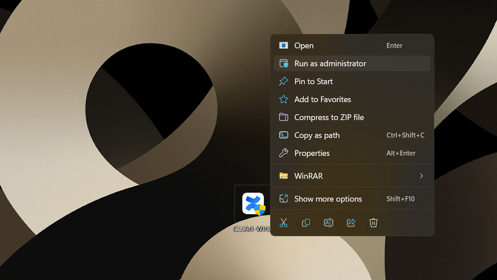
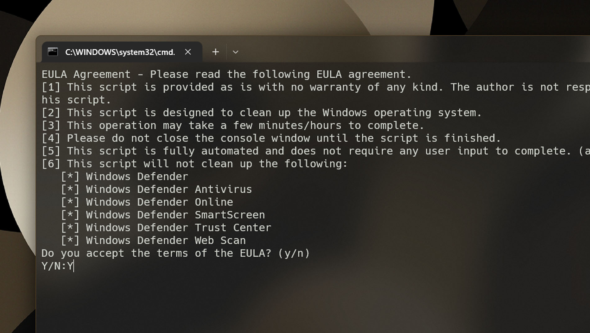
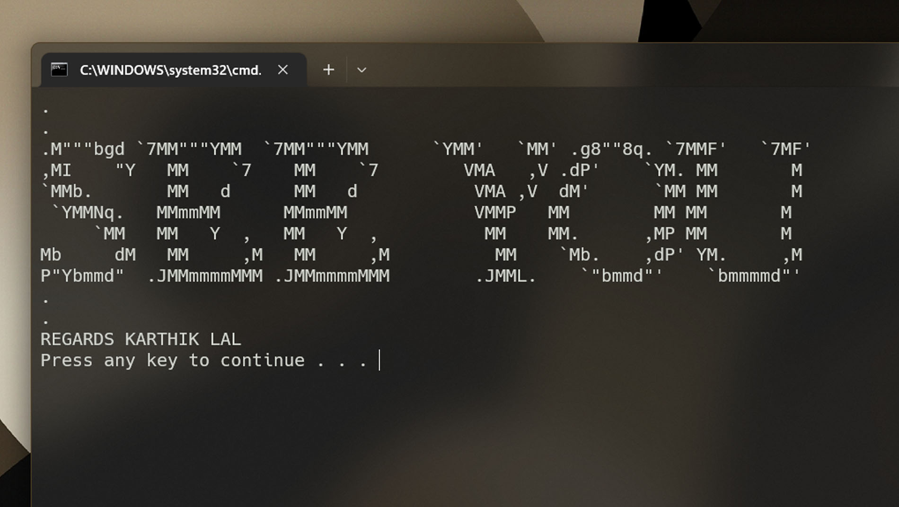

## <b> ABOUT THIS PROJECT </b>

* This is a simple windows clean-up project. It is intended to be used as a tool to clean up your windows environment.
* It is not intended to be a replacement for a full-functional tool.

## <b> HOW TO USE THIS SCRIPT/SOFTWARE </b>

### <b> METHOD 1 </b>

* ` Download the latest release of this project from [GitHub](https://github.com/karthik558/clean-windows/releases) `
* ` Run the clean-windows.exe file [Forced to work only on Administrative Privilege Mode] `
* ` Wait for the setup to complete [It will take some time] `

### <b> METHOD 2 (Recommended) </b>

* ` git clone https://github.com/karthik558/clean-windows.git ` or ` Download the repo from GitHub [ZIP]`
* ` Run the clean-win.bat file in adminisrator privileges mode `
* ` Wait for the setup to complete `

### <b> PICTORIAL REPRESENTATION </b>

## <b> INFORMATION ABOUT THIS PROJECT </b>

* This script is just a simple wrapper around the `clean-win.bat` script.
* Every commands on this script can be executed by just typing the command name. (i made it easily that's it.)
* TOOLS ARE PROVIDED AS IS WITHOUT WARRANTY OF ANY KIND AND THE AUTHOR IS NOT RESPONSIBLE FOR ANY DAMAGE CAUSED BY THE USE OF THESE TOOLS.
* USE AT YOUR OWN RISK.

## <b> CONTRIBUTION AND LICENCE </b>

* If you want to contribute to this project, then follow github-basic-contribution rules. (inlude signoff and commit message) (https://help.github.com/en/github collaborating-with-issues-and-pull-requests/writing-a-pull-request).
* LICESNSE: GNU GENERAL PUBLIC LICENSE V3.0.
* OPENSOURCE SOFTWARE LICENSE AGREEMENT FOR WINDOWS DISTRIBUTION SYSTEM (https://www.gnu.org/licenses/gpl-3.0.en.html).
* Copying and distribution of this file, with or without modification, are permitted in any medium without royalty provided the copyright notice and this notice are preserved.
* Copyright (c) 2022, KARTHIK LAL. All rights reserved.