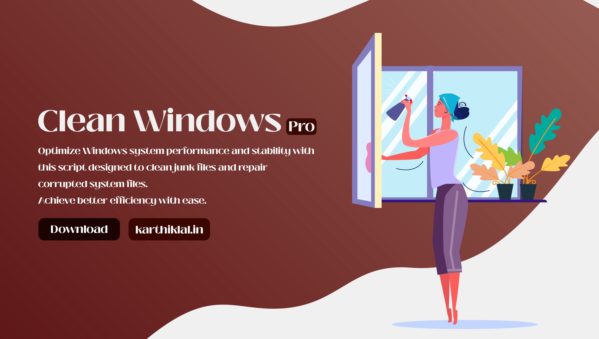

## Table of Contents
- [Overview](#Overview)
- [Features](#Features)
- [Screenshots](#Screenshots)
- [Installation](#Installation)
- [Usage](#Usage)
- [Contributing](#Contributing)
- [License](#License)

## Overview

This Windows clean-up project provides a streamlined and straightforward approach to optimize your system. In addition to clearing up space, it also features a DNS server changing capability. While this tool is intended to be used as a supplementary tool to clean up your Windows environment, it should not be considered a substitute for a full-featured tool. Though it provides basic features that can improve your system's performance, it lacks advanced capabilities that comprehensive software can offer. With this tool, you can efficiently keep your Windows environment clean while enjoying the convenience of the DNS server changing capability.

## Features

- Clean up temporary files and folders on your system to free up space and improve performance.
- Can be used to change the DNS server on your system to improve your browsing experience.
- Provides a streamlined and straightforward approach to optimize your system.
- Can be used as a supplementary tool to clean up your Windows environment.

## Screenshots

<table>
  <tr>
    <td></td>
    <td></td>
    <td>      
  </tr>
  <tr>
    <td></td>
    <td></td>
    <td></td>
  </tr>
</table>

## Installation

To install CleanWindowsPro, follow these steps:

1. Download the latest version of the tool from the [releases page](https://github.com/karthik558/CleanWindowsPro/releases).
2. Choose the appropriate version for your system (32-bit or 64-bit) [Recommended: 64-bit/CleanWindowsPro.cmd].
3. Run the CleanWindowsPro.cmd as an administrator. (Right-click on the tool and select "Run as administrator")
4. Follow the on-screen instructions to clean up your system. (You can also change the DNS server on your system)

## Usage

To use CleanWindowsPro, follow these steps:

1. Run the tool as an administrator. (Right-click on the tool and select "Run as administrator")
2. Select the appropriate option from the menu. (1: Fully Automate, 2: Clear Temporary, 3: Clear System Restore Points, 4: Repair Damaged System Files, 5: Clear DNS Cache, 6: Use Custom DNS Server, 7: Exit, 8: EULA)
3. Follow the on-screen instructions to clean up your system. (You can also change the DNS server on your system)
4. If you selected the "Use Custom DNS Server" option, enter the DNS server you want to use and then select the interface you want to use it on. Example: Ethernet, Wi-Fi, etc.
5. If you selected the "Fully Automate" option, the tool will automatically clean up your system. [Recommended: Use this option]
6. If you selected the "Clear Temporary" option, the tool will clear temporary files and folders on your system. [Quick Clean-up]
7. If you selected the "Clear System Restore Points" option, the tool will clear all system restore points on your system. [Not Recommended]
8. If you selected the "Repair Damaged System Files" option, the tool will repair damaged system files on your system. [Recommended: Use this option]

## Contributing

Contributions to this CleanWindowsPro are welcome and appreciated. To contribute to the project, please follow these steps:

1. Fork the repository by clicking on the `"Fork"` button in the top-right corner of the repository page
2. Clone your fork of the repository by running   `git clone https://github.com/yourusername/CleanWindowsPro.git`
3. Create a new branch for your feature or bug fix by running `git checkout -b my-new-feature`
4. Make changes to the code and test your changes locally
5. Commit your changes by running `git commit -am 'Add some feature'`
6. Push your changes to your fork of the repository by running `git push origin my-new-feature`
7. Create a new pull request by going to the repository page on GitHub and clicking on the "New pull request" button

## License

* The CleanWindowsPro Tool is open source software licensed under the MIT license. See the [LICENSE](LICENSE) file for more information.
* Copying and distribution of this file, with or without modification, are permitted in any medium without royalty provided the copyright notice and this notice are preserved.
* Copyright © 2022-2023 , <b>KARTHIK LAL</b>. All rights reserved.